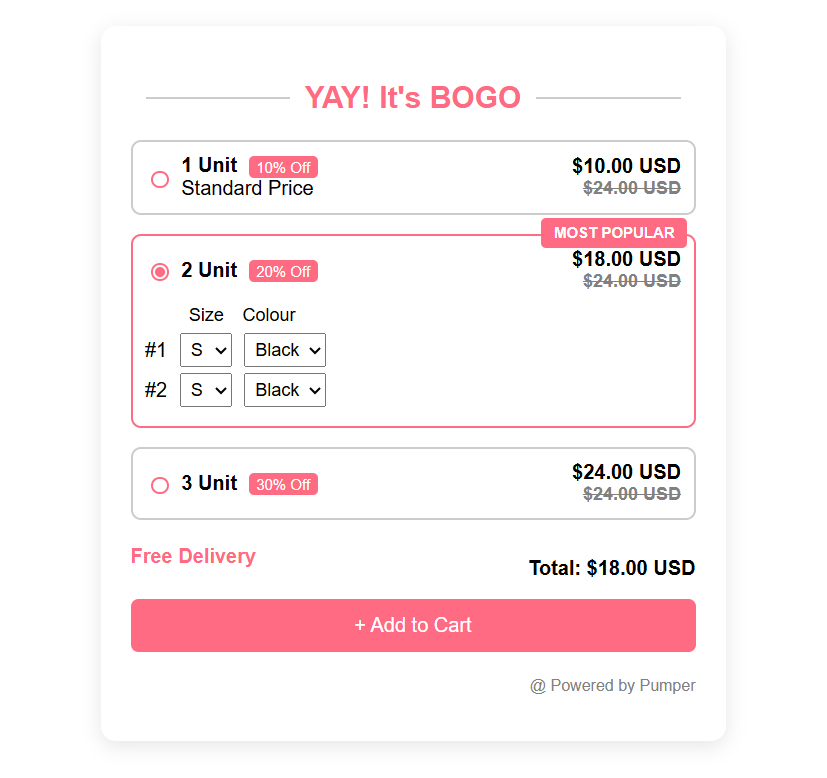

# 🎉 YAY! It's BOGO – Interactive Offer UI

This is a simple front-end project built using **HTML, CSS, and Vanilla JavaScript** that replicates a "Buy One Get One" styled offer interface.
---

## 🚀 Features

- Three unit selection options (1, 2, 3 units)
- Dynamic price updates on selection
- "MOST POPULAR" ribbon highlight for 2-unit offer
- Dropdowns for size and color (only for 2-unit combo)
- Styled to match a modern ecommerce promotional layout
- Fully responsive and **no external libraries used**

---

bogo-interactive-units-vinodh.netlify.app
## 🛠️ Technologies Used

- HTML5
- CSS3 (no frameworks)
- JavaScript (Vanilla)

---

## 📂 Project Structure

IT-S-BOGO/
├── index.html # Main HTML page
├── style.css # Custom styles
├── script.js # JavaScript interactivity
└── README.md # Project documentation
